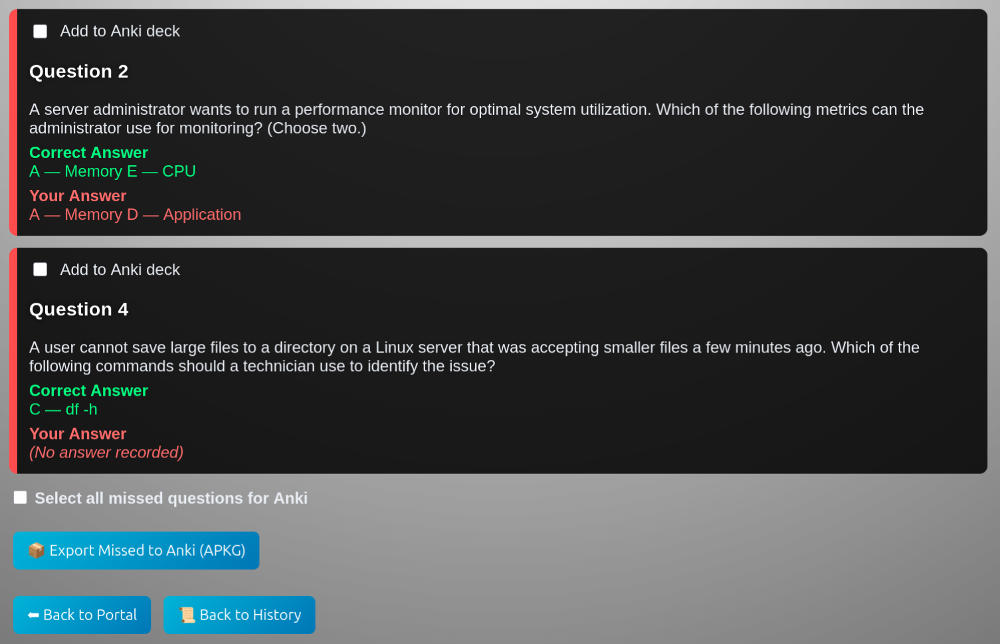

This is version 1.1 Created on 1/9/26 by Mike Buchanan# DLMS – Digital Learning & Management System

DLMS is a self-hosted quiz and learning application designed for study, practice,
and exam preparation. It supports both **Study Mode** and **Exam Mode**, detailed
attempt history, confidence analysis, and Anki export for long-term retention.

Why DLMS Exists

DLMS was created to address a gap between simple quiz tools and full-scale learning management systems. Many existing solutions are either too limited for serious study or too complex, restrictive, or heavyweight for individual learners, educators, and IT professionals.

DLMS is designed to be local, transparent, and learner-focused. It gives users full control over their content, data, and study workflow without requiring cloud accounts, subscriptions, or external services. By running entirely on the user’s system as a local web application, DLMS prioritizes privacy, reliability, and portability.

For users who prefer deeper system integration, DLMS can also be enabled as a systemd service (This is what I do!).

The project emphasizes learning effectiveness, not just assessment. Features like Study Mode, confidence analysis, attempt history, and Anki export are intended to help users identify weak areas, reinforce understanding, and retain knowledge over time. Especially in certification, technical training, and self-directed study scenarios.

DLMS exists because effective learning tools should be:

Powerful without being bloated

Flexible without being fragile

Private by default

Open for inspection, improvement, and reuse


DLMS runs as a **local web application**.

---

## 🚀 How to Use DLMS (Important)

After starting DLMS, **open a web browser** and go to:

👉 **http://127.0.0.1:9001/**

This is the main interface for the application.

DLMS does **not** open a browser automatically.

---

## ✨ Key Features

- Study Mode and Exam Mode
- Upload or paste quiz questions
- Advanced parsing tools using regular expressions (regex)
- Attempt history and performance tracking
- Confidence analysis (optional)
- Export missed questions to **Anki**
- Custom quiz logos and portal appearance

---

## 🧠 Study Mode & Learning Tools

Study Mode is designed to help users learn and reinforce concepts rather than
simulate a timed exam. Users can review questions, analyze confidence levels,
and focus on missed material.

(See screenshots below. No logos or quiz questions/answers are provided)
### Study Mode Examples


### Anki Export Examples




---

## 🧩 Anki Integration

DLMS supports exporting missed questions to Anki, a proven spaced-repetition
learning system. This allows users to turn weak areas into targeted study decks
for long-term retention.

---

## 🖥️ Running DLMS

### From a prebuilt binary (recommended)
1. Download the appropriate binary for your operating system from **Releases**
2. Run the DLMS executable
3. Open a browser and go to **http://127.0.0.1:9001/**

### From source (advanced users)
```bash
python app.py

## 📂 Data & Configuration

On first run, DLMS creates its data directory in your user profile and initializes
its database and configuration files automatically.

No external database or web server is required.